<div align="center">
  
</div>

<br/>

> **Charlie** &middot; solo builder shipping AI-native SaaS and local-first tools from France.
> Currently most interested in **agents that do real work** and **software that runs on your own hardware**.

---

## Now &middot; May 2026

- Building **[deviso.pro](https://deviso.pro)** &mdash; quoting & invoicing SaaS for landscapers
- Building **[callmatch.io](https://callmatch.io)** &mdash; instant 1:1 pro networking, &lt;60s match, 5 min P2P call
- Open-sourcing **[local-jarvis](https://github.com/Sycatle/local-jarvis)** &mdash; fully-local Linux voice assistant in Rust
- Writing on **[bio.sycatle.dev](https://bio.sycatle.dev)**

---

## Selected work

### Open source

| | |
|---|---|
| **[local-jarvis](https://github.com/Sycatle/local-jarvis)** | Fully-local Linux voice assistant. Rust workspace, systemd + D-Bus daemon, Whisper &middot; Qwen2.5 &middot; Kokoro &middot; openWakeWord. No cloud. |
| **[asap-website-builder](https://github.com/Sycatle/asap-website-builder)** | Ship a professional website in minutes &mdash; portfolio, business, vitrine. Self-hostable, open source. |
| **[discord-agent](https://github.com/Sycatle/discord-agent)** | `ada` &mdash; a Discord agent that helps you build your server. |

### Own SaaS (closed-source, live)

- **[deviso.pro](https://deviso.pro)** &mdash; quoting & invoicing for landscapers
- **[callmatch.io](https://callmatch.io)** &mdash; instant pro networking calls, opt-in LinkedIn

### Client &amp; freelance work

- SaaS &amp; product engineering for French B2B clients &mdash; full-stack Next.js, Stripe, FR-hosted infra. References on request.

### Experiments &amp; earlier

`sychess` &middot; `rust-cart-api` &middot; `fpm` &middot; `chat.whispee.fr`

---

## Stack

```text
Building with  →  TypeScript · Next.js · Rust · Python
Backing on     →  Postgres · Supabase · Stripe · Drizzle · Prisma
Running on     →  Linux · Docker · self-hosted (FR) · Vercel
Agents with    →  Claude · MCP · local LLMs (Qwen, Whisper, Kokoro)
```

---

## Reach out

[**sycatle.dev**](https://sycatle.dev) &middot; [**bio.sycatle.dev**](https://bio.sycatle.dev)
Open to: solo collabs &middot; freelance engagements &middot; hiring conversations.
